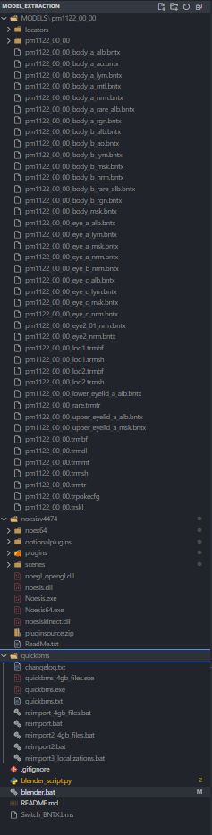

# SV Model Converter

This batch script runs various executables in order to convert both the model textures, models, and animations into usable .fbx models using ChicoEevee's Pokemon-Switch-Model-Importer-Blender: https://github.com/ChicoEevee/Pokemon-Switch-Model-Importer-Blender

Currently works in Windows

## Installation 

1. Download the SV-Poke.zip and SV-PokeAnim.zip files from here: https://www.vg-resource.com/thread-25872.html
1. Download Noesis here: https://richwhitehouse.com/index.php?content=inc_projects.php&filemirror=noesisv4474.zip.  Move the directory into the root
2. Download quickbms here: https://aluigi.altervista.org/papers/quickbms.zip. Move the directory into the root
3. download the Switch BNTX here: https://mega.nz/file/ekRjwTjQ#6Cgvwr9Duj7U8JjpcLiotN6nMiQKU2SzfV8lRdxSfXs. Move the .bms file into the root
4. Install Blender 4.3, and install the Importer package found here: https://github.com/ChicoEevee/Pokemon-Switch-Model-Importer-Blender

## Instructions

1. Find The Pokemon you wish to extract, i.e PM_1004 from the Pokemon Model Ripping Project
2. Copy all the model folders into MODELS, put the respective animation folder inside each one of these.  The directory structure should look like this:k

3. Run the blender.bat script.  This does everything, from creating the .png files, to the final .fbx with the animations imbedded.
